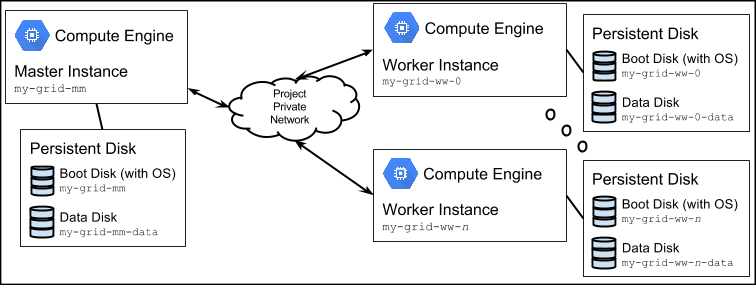

Google Compute Engine Cluster for Grid Engine
=============================================

------------

> **This repository is deprecated.**
>
> See  [Create a Grid Engine cluster on Google Compute Engine](http://googlegenomics.readthedocs.org/en/latest/use_cases/setup_gridengine_cluster_on_compute_engine/index.html) for instructions from the Google Genomics team.

------------

Copyright
---------

Copyright 2014 Google Inc. All Rights Reserved.

Licensed under the Apache License, Version 2.0 (the "License");
you may not use this file except in compliance with the License.
You may obtain a copy of the License at

[http://www.apache.org/licenses/LICENSE-2.0](http://www.apache.org/licenses/LICENSE-2.0)

Unless required by applicable law or agreed to in writing, software
distributed under the License is distributed on an "AS IS" BASIS,
WITHOUT WARRANTIES OR CONDITIONS OF ANY KIND, either express or implied.
See the License for the specific language governing permissions and
limitations under the License.

Disclaimer
----------

This sample application is not an official Google product.

Summary
-------

This document describes how to bring up a cluster of Google Compute Engine
(GCE) instances running [Grid Engine](http://packages.qa.debian.org/gridengine).
The result of following these instructions is illustrated in Figure 1 below.

Figure 1: One Grid Engine Master instance and multiple Grid Engine Worker instances

Prerequisites
-------------

The application assumes you have a
[Google Cloud Platform](http://cloud.google.com) project created and that
[Google Compute Engine](https://developers.google.com/compute/docs/signup)
services are enabled on the project.

Make sure to have the latest version of the
[Cloud SDK](https://cloud.google.com/cloud/sdk/) installed
and added to your PATH environment variable.

#### Authenticaton and default project

After the installation of Cloud SDK, run the following command to authenticate:

    gcloud auth login

The above command authenticates the user, and allows you to set the default
project.  The default project must be set to the project where the Grid Engine
cluster will be deployed.

The project ID is shown at the top of the project's "Overview" page
of the [Developers Console](https://console.developers.google.com/).

The default project for Cloud SDK tools can be changed with the command:

    gcloud config set project <project ID>

Environment
-----------
The application runs under the [bash shell](http://www.gnu.org/software/bash/).
It has been tested on Mac OS X and Linux.

Setup
-----
The script `cluster_setup.sh` is used to create a cluster of Compute Engine
virtual machine instances along with boot and data disks.

Instructions for installing and configuring Grid Engine are provided below.

1. Edit `cluster_properties.sh`:

    a. Set `CLUSTER_PREFIX`

    default: `my-grid`

    b. Set `MASTER_NODE_MACHINE_TYPE` (see [Machine Types](https://cloud.google.com/compute/docs/machine-types))

    default: `n1-standard-4`

    c. Set `MASTER_NODE_DISK_SIZE` (see [Persistent Disks](https://cloud.google.com/compute/docs/disks/))

    default: `500GB`

    d. Set `WORKER_NODE_MACHINE_TYPE` (see [Machine Types](https://cloud.google.com/compute/docs/machine-types))

    default: `n1-standard-4`

    e. Set `WORKER_NODE_DISK_SIZE` (see [Persistent Disks](https://cloud.google.com/compute/docs/disks/))

    default: `500GB`

    f. Set `WORKER_NODE_COUNT`

    default: `2`

    g. Set `MASTER_NODE_SCOPE`

    default: _none_

    If the master node will access Google Cloud Storage, set:

        MASTER_NODE_SCOPE=https://www.googleapis.com/auth/devstorage.full_control

    h. Set `WORKER_NODE_SCOPE`

    default: _none_

    If the worker node(s) will access Google Cloud Storage, set:

        WORKER_NODE_SCOPE=https://www.googleapis.com/auth/devstorage.full_control

1. Run `cluster_setup.sh`:

        ./cluster_setup.sh up-full

   When completed you will have a master instance running named
   *CLUSTER_PREFIX*`-mm` and worker instances named
   *CLUSTER_PREFIX*`-ww-`*INSTANCE_NUMBER* where instances are numbered
   starting at 0.

   Each instance runs `instance_startup_script.sh` as a
   [startup-script](https://cloud.google.com/compute/docs/startupscript)
   when it starts.

1. Connect to the master:

        gcloud compute ssh <master_hostname> --zone <master_zone>

1. Install the Grid Engine components:

        sudo apt-get install --yes \
          gridengine-client \
          gridengine-qmon \
          gridengine-exec \
          gridengine-master

    Configure SGE automatically?  **YES** 
    SGE cell name:  **default** 
    SGE master hostname:  **&lt;enter your master hostname&gt;** 

1. On the master, set up Grid Engine:

        # Add your userid as a Grid Engine admin
        sudo sudo -u sgeadmin qconf -am $USER

        # Add your userid as a Grid Engine user
        qconf -au $USER users

        # Add the master as submission host
        qconf -as $(hostname)

        # Add the @allhosts group
        qconf -ahgrp @allhosts

    _Just save the file without changes_

        # Add the master to the list of hosts
        qconf -aattr hostgroup hostlist $(hostname) @allhosts

        # Register the main queue
        qconf -aq main.q

    _Just save the file without changes_

        # Add the @allhosts group to the main queue
        qconf -aattr queue hostlist @allhosts main.q

        # Set the slots attribute to the number of CPUs on each of the nodes (4).
        # On the master host, leave one (4-1 = 3) for the master process
        qconf -aattr queue slots "4, [$(hostname)=3]" main.q

1. On the master, for each worker node:

        # Add the worker as a submit host
        qconf -as <worker_hostname>

        # Add the worker to the host list
        qconf -aattr hostgroup hostlist <worker_hostname> @allhosts

1. For each worker node:

    a. Connect to the worker node:

            gcloud compute ssh <worker_hostname> --zone <worker_zone>

    b. On the worker node, install the Grid Engine components:

            sudo apt-get install --yes \
              gridengine-client \
              gridengine-exec

    Configure SGE automatically?  **YES** 
    SGE cell name:  **default** 
    SGE master hostname:  **&lt;enter your master hostname&gt;** 

Test
----
1. Connect to the master:

        gcloud compute ssh <master_hostname> --zone <master_zone>

1. On the master, run qhost:

        # You should get a list including the master and worker nodes
        qhost

1. On the master, submit a test job:

        qsub /usr/share/doc/gridengine-common/examples/simple.sh

1. On the master, check the job status:

        # The job will show in output until it is complete
        # The "queue" column will indicate the host that job runs on
        # Note that in this setup, the master is one of the available
        # execution nodes.
        qstat

1. On the job execution node, check for the output.
   `ls` in your home directory on the execution node should show
   "simple.sh.e1  simple.sh.o1"

Cluster Lifecycle
-----------------
You can now bring your cluster down either permanently or when you expect it to be idle for an extended period of time (and want to save money).

* To bring down your cluster completely (**destroys instances and disks**):

    ./cluster_setup.sh down-full

* To bring down your cluster and preserve the boot and data disks:

    ./cluster_setup.sh down

* To bring up a cluster where the boot and data disks already exist:

    ./cluster_setup.sh up

  If you already ran the installation of Grid Engine as described above,
  then the cluster of instances should start along with Grid Engine.
  There is no need to re-run any part of the installation.

* To bring up a cluster completely (**creates instances and disks**):

    ./cluster_setup.sh up-full

